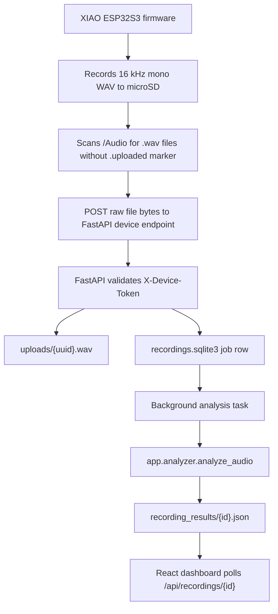

# Wearable MVP Setup and Architecture Guide

This guide is for setting up, testing, and understanding the end-to-end wearable conversation analytics MVP.

The goal of the current MVP:

```text
XIAO ESP32S3 records WAV audio to microSD
        -> XIAO uploads the completed WAV over Wi-Fi
        -> FastAPI backend stores it as a recording job
        -> backend runs the existing transcription/diarization/metrics analyzer
        -> React web app shows upload status and completed metrics
```

## Repository Layout

Important files:

```text
app/main.py
  FastAPI app and HTTP endpoints.

app/recordings.py
  SQLite recording-job storage and analysis job runner.

app/analyzer.py
  Existing audio analysis pipeline: ffmpeg, Whisper, diarization, metrics.

frontend/src/main.jsx
  React dashboard for uploads, recording status, and completed metrics.

firmware/xiao-esp32s3-prototype/AudioRecording.ino
  XIAO ESP32S3 firmware: record WAV to SD and upload pending recordings.

firmware/xiao-esp32s3-prototype/firmware_config.example.h
  Template for local Wi-Fi/server/device settings.

scripts/run.sh / scripts/run.ps1
  Installs backend/frontend dependencies and runs the web app.

scripts/test.js
  Cross-platform no-hardware software validation used by `npm test`.

scripts/build_firmware.js
  Cross-platform firmware compile helper used by `npm run build:firmware`.

scripts/install_diarization.sh / scripts/install_diarization.ps1
  Installs optional pyannote/resemblyzer diarization dependencies.

scripts/simulate_device_upload.py
  Pretends to be the wearable and uploads an audio file to the device endpoint.
```

## What You Need

For backend/frontend testing on macOS, Windows, or Linux:

- Python 3.11 or 3.12
- Node/npm
- ffmpeg

For firmware testing:

- XIAO ESP32S3 / XIAO ESP32S3 Sense setup
- microSD card
- Arduino/PlatformIO-compatible USB cable
- Serial Monitor at `115200` baud
- Wi-Fi network credentials for the network the board should use

Install system dependencies on macOS:

```bash
brew install python@3.12 ffmpeg node
```

Install system dependencies on Windows PowerShell:

```powershell
winget install Python.Python.3.12
winget install Gyan.FFmpeg
winget install OpenJS.NodeJS.LTS
```

After installing on Windows, close and reopen PowerShell so `python`, `py`, `ffmpeg`, `node`, and `npm` are available on PATH.

If PowerShell blocks local scripts, run this once for the current user:

```powershell
Set-ExecutionPolicy -Scope CurrentUser RemoteSigned
```

## 1. Clone and Run Software Tests

From the repository root:

macOS/Linux:

```bash
./scripts/run.sh
```

Windows PowerShell:

```powershell
.\scripts\run.ps1
```

That creates `.venv`, installs Python packages, installs/builds the React frontend, and starts the FastAPI app.

In a second terminal, run:

```bash
npm test
```

Expected result:

```text
Ran 4 tests ... OK
vite build ... built
```

What this proves:

- Python files compile.
- Device token rejection works.
- Simulated raw wearable upload works.
- Browser upload uses the same job pipeline.
- Recording result retrieval works.
- Firmware config handoff files are present.
- React frontend builds.

## 2. Run the Web App

Start the backend:

macOS/Linux:

```bash
DEVICE_UPLOAD_TOKEN=dev-device-token ./scripts/run.sh
```

Windows PowerShell:

```powershell
$env:DEVICE_UPLOAD_TOKEN = "dev-device-token"
.\scripts\run.ps1
```

Open:

```text
http://127.0.0.1:8000
```

The sidebar has:

- Browser test upload
- Recordings list
- Status for uploaded/processing/complete/failed jobs

## 3. Test Without the Wearable

Use any short audio file, preferably WAV or MP3:

macOS/Linux:

```bash
python scripts/simulate_device_upload.py path/to/audio.wav \
  --server http://127.0.0.1:8000 \
  --device-id simulated-xiao \
  --token dev-device-token
```

Windows PowerShell:

```powershell
.\.venv\Scripts\python.exe scripts\simulate_device_upload.py path\to\audio.wav `
  --server http://127.0.0.1:8000 `
  --device-id simulated-xiao `
  --token dev-device-token
```

Expected behavior:

1. The script returns JSON with a recording `id`.
2. The web app sidebar shows the uploaded recording.
3. Status changes from `Uploaded` or `Processing` to `Complete`.
4. Completed metrics appear in the main dashboard.

This uses the same raw endpoint that the firmware uses:

```text
POST /api/device/recordings/raw?filename=audio0001.wav
X-Device-Id: simulated-xiao
X-Device-Token: dev-device-token
Content-Type: application/octet-stream
```

## Optional: Stronger Speaker Diarization

The backend can use pyannote.audio for stronger diarization when configured. This is optional; without it, the app still runs using the fallback behavior.

Install optional dependencies:

macOS/Linux:

```bash
./scripts/install_diarization.sh
```

Windows PowerShell:

```powershell
.\scripts\install_diarization.ps1
```

Then run the backend with a Hugging Face token after accepting the terms for `pyannote/speaker-diarization-3.1`.

macOS/Linux:

```bash
HF_TOKEN=your_token_here DEVICE_UPLOAD_TOKEN=dev-device-token ./scripts/run.sh
```

Windows PowerShell:

```powershell
$env:HF_TOKEN = "your_token_here"
$env:DEVICE_UPLOAD_TOKEN = "dev-device-token"
.\scripts\run.ps1
```

## 4. Configure the Firmware

Go to:

macOS/Linux:

```bash
cd firmware/xiao-esp32s3-prototype
cp firmware_config.example.h firmware_config.h
```

Windows PowerShell:

```powershell
cd firmware\xiao-esp32s3-prototype
Copy-Item firmware_config.example.h firmware_config.h
```

Edit `firmware_config.h`:

```cpp
const char *WIFI_SSID = "YOUR_WIFI_NAME";
const char *WIFI_PASSWORD = "YOUR_WIFI_PASSWORD";

const char *SERVER_BASE_URL = "http://192.168.1.42:8000";

const char *DEVICE_ID = "xiao-esp32s3-prototype-001";
const char *DEVICE_UPLOAD_TOKEN = "dev-device-token";
```

Important:

- `firmware_config.h` is ignored by git.
- Do not commit real Wi-Fi passwords.
- `SERVER_BASE_URL` must be reachable from the board.
- Do not use `127.0.0.1` for the board. On the board, `127.0.0.1` means the board itself.

## 5. Find the Backend Laptop IP

If the board and laptop are on the same Wi-Fi, the server URL should use the laptop's LAN IP.

On macOS:

```bash
ipconfig getifaddr en0
```

On Windows PowerShell:

```powershell
ipconfig
```

Look for the active Wi-Fi adapter's `IPv4 Address`, usually something like:

```text
192.168.1.42
```

Example output:

```text
192.168.1.42
```

Then set:

```cpp
const char *SERVER_BASE_URL = "http://192.168.1.42:8000";
```

Run the backend on all network interfaces:

macOS/Linux:

```bash
DEVICE_UPLOAD_TOKEN=dev-device-token PORT=8000 .venv/bin/uvicorn app.main:app --host 0.0.0.0 --port 8000
```

Windows PowerShell:

```powershell
$env:DEVICE_UPLOAD_TOKEN = "dev-device-token"
.\.venv\Scripts\python.exe -m uvicorn app.main:app --host 0.0.0.0 --port 8000
```

Then from another device on the same Wi-Fi, open:

```text
http://192.168.1.42:8000/api/health
```

Expected:

```json
{"status":"ok"}
```

## 6. Compile the Firmware

From the repository root:

macOS/Linux:

```bash
.venv/bin/python -m pip install platformio
npm run build:firmware
```

Windows PowerShell:

```powershell
.\.venv\Scripts\python.exe -m pip install platformio
npm run build:firmware
```

Expected result:

```text
Processing xiao_esp32s3 ...
Dependency Graph
|-- ESP_I2S
|-- FS
|-- HTTPClient
|-- SD
|-- SPI
|-- WiFi
...
[SUCCESS]
```

This repo uses the pioarduino ESP32 PlatformIO package because the sketch depends on the ESP32 Arduino 3.x `ESP_I2S.h` API. The default PlatformIO ESP32 platform may install Arduino 2.x, which does not include `ESP_I2S.h`.

## 7. Flash and Watch Serial Logs

Flash using PlatformIO, Arduino IDE, or your preferred ESP32 workflow.

With PlatformIO, once a board is connected:

macOS/Linux:

```bash
PLATFORMIO_CORE_DIR=.platformio .venv/bin/pio run -e xiao_esp32s3 -t upload
```

Windows PowerShell:

```powershell
$env:PLATFORMIO_CORE_DIR = ".platformio"
.\.venv\Scripts\pio.exe run -e xiao_esp32s3 -t upload
```

Open Serial Monitor at:

```text
115200 baud
```

Useful messages:

```text
XIAO ESP32S3 Sense Audio Recorder Starting...
I2S microphone OK.
MicroSD Card Type: SDHC
Connecting to Wi-Fi SSID: ...
Wi-Fi connected. Device IP: ...
Uploading /Audio/audio0001.wav (...) to http://...
Upload response status: 200
Upload complete. Marker written: /Audio/audio0001.wav.uploaded
```

If upload succeeds, the web app should show a new device recording.

## 8. Current Architecture



### Backend Endpoints

Device upload:

```text
POST /api/device/recordings/raw?filename=audio0001.wav
```

Multipart device upload:

```text
POST /api/device/recordings
```

Browser test upload:

```text
POST /api/recordings
```

List recordings:

```text
GET /api/recordings
```

Get one recording and completed result:

```text
GET /api/recordings/{recording_id}
```

Retry analysis:

```text
POST /api/recordings/{recording_id}/analyze
```

### Job States

```text
uploaded
  The backend has received the audio file.

processing
  The analyzer is running.

complete
  Metrics JSON is available.

failed
  Analysis or upload handling failed. The error field should explain why.
```

## 9. What Happens If the Device Does Not Know the Wi-Fi Password?

Short answer: the device cannot upload over a private Wi-Fi network unless it has credentials or some other internet path.

Wi-Fi is not magic. A wearable needs one of these:

1. **Preconfigured Wi-Fi credentials**
   The simplest MVP. Hardcode or configure SSID/password before flashing.

2. **Phone or web-based Wi-Fi provisioning**
   The device temporarily starts its own setup network or BLE setup flow. A phone/web app sends the user's Wi-Fi credentials to the device. After that, the device joins the user's Wi-Fi normally.

3. **Phone bridge**
   The wearable sends recordings to a phone over BLE or local Wi-Fi. The phone uploads to the cloud using its own internet connection.

4. **Cellular modem**
   The wearable includes LTE-M/NB-IoT/LTE hardware and a SIM/eSIM/data plan. It uploads directly without Wi-Fi, but hardware, power, cost, and firmware complexity increase a lot.

5. **User hotspot**
   The user turns on a phone hotspot. The wearable joins that known hotspot and uploads.

6. **Store-and-forward**
   The wearable records offline to SD and uploads later when it reaches a known Wi-Fi network.

For this MVP, the current solution is option 1 plus option 6:

```text
Record offline -> save to SD -> upload when known Wi-Fi is available
```

## 10. How Real Products Usually Handle This

Most real-world wearables use one of these patterns:

### Pattern A: Phone Companion App

```text
Wearable -> BLE -> phone app -> cloud backend -> web/mobile dashboard
```

Pros:

- Works away from home Wi-Fi.
- Phone already has internet.
- Phone UI can handle login, Wi-Fi setup, upload progress, permissions, and retries.

Cons:

- Requires building iOS/Android app.
- BLE file transfer for long audio can be slow unless carefully designed.

Best future path if the product is meant to work while walking around in public.

### Pattern B: Wi-Fi Provisioning

```text
Phone/browser gives Wi-Fi password to wearable once
Wearable joins Wi-Fi
Wearable uploads directly to backend
```

Pros:

- No cellular hardware.
- Direct upload can be faster than BLE.
- Good for home/office use.

Cons:

- Does not work on unknown Wi-Fi until provisioned.
- Public/captive portal Wi-Fi is hard or impossible for small embedded devices.

Best future path if the device is mainly used around home, school, office, or known networks.

### Pattern C: Cellular Wearable

```text
Wearable -> cellular network -> cloud backend
```

Pros:

- Works without Wi-Fi or phone.
- Most independent product experience.

Cons:

- More expensive hardware.
- Requires data plan/SIM/eSIM.
- Higher power use.
- More certification and carrier complexity.

Best future path only if always-connected behavior is core to the product.

### Pattern D: Dock or USB Sync

```text
Wearable -> USB/dock/computer -> upload to backend
```

Pros:

- Simple and reliable.
- Lower power.
- Useful for early pilots.

Cons:

- Not seamless.
- User has to remember to sync.

Good fallback even if you later add phone or Wi-Fi upload.

## 11. Recommended Product Roadmap

### MVP Now

Use the current implementation:

```text
Known Wi-Fi credentials in firmware_config.h
XIAO uploads to laptop/server
Backend analyzes
Dashboard shows metrics
```

This is enough to test:

- recording quality
- upload reliability
- backend job flow
- analytics quality
- user-facing dashboard

### Next Prototype

Add Wi-Fi provisioning:

```text
Board starts setup mode if no Wi-Fi config exists
User connects phone/laptop to device setup network
User enters Wi-Fi credentials + backend URL/token
Board stores config in non-volatile storage
```

This removes the need to reflash firmware for every Wi-Fi network.

### Stronger Product Direction

Build a phone companion app:

```text
Wearable records to SD
Phone app discovers wearable
Wearable transfers files to phone
Phone uploads to backend
Web/mobile app shows results
```

This is the most realistic path if users should record in public and view analytics soon after.

## 12. Troubleshooting

### Backend Is Running But Board Cannot Upload

Check:

- Backend was started with `--host 0.0.0.0`.
- `SERVER_BASE_URL` uses laptop LAN IP, not `127.0.0.1`.
- Laptop and board are on the same Wi-Fi.
- Firewall allows inbound connections on port `8000`.
- `DEVICE_UPLOAD_TOKEN` matches exactly.

### Firmware Compile Fails With `ESP_I2S.h` Missing

Use the included PlatformIO config and command:

```bash
npm run build:firmware
```

The default PlatformIO ESP32 platform may not work because it can use Arduino 2.x.

### Upload Returns 401

The board token does not match the backend token.

Backend:

macOS/Linux:

```bash
DEVICE_UPLOAD_TOKEN=dev-device-token ./scripts/run.sh
```

Windows PowerShell:

```powershell
$env:DEVICE_UPLOAD_TOKEN = "dev-device-token"
.\scripts\run.ps1
```

Firmware:

```cpp
const char *DEVICE_UPLOAD_TOKEN = "dev-device-token";
```

### Upload Succeeds But Analysis Fails

Open the recording in the web app and check the error. Common causes:

- `ffmpeg` is missing.
- audio file is corrupt or empty.
- Whisper model download failed.
- optional diarization dependencies are missing.

### Public Wi-Fi Does Not Work

Many public Wi-Fi networks use captive portals. Small embedded devices generally cannot click through login pages. Use a phone hotspot, known Wi-Fi network, or phone companion app path instead.

## 13. What to Send Back After Hardware Testing

If something fails, send:

1. Serial Monitor logs from boot through upload attempt.
2. The exact `SERVER_BASE_URL` used, with private parts redacted if needed.
3. Backend terminal logs.
4. Whether `http://LAPTOP_IP:8000/api/health` opens from another device on the same Wi-Fi.
5. The filename and size of the WAV file on SD.
